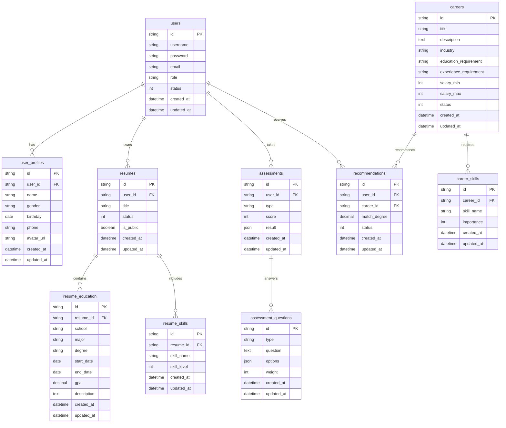

# 高校职业推荐系统数据库ER图

> 最后更新时间：2024-03-21

## 一、整体ER图

## 二、实体关系说明

### 1. 用户相关实体
- users：用户基本信息
- user_profiles：用户详细信息
- 关系：一对一关系，一个用户对应一个详细信息

### 2. 简历相关实体
- resumes：简历基本信息
- resume_education：教育经历
- resume_skills：技能信息
- 关系：
  - 一个用户可以有多份简历（一对多）
  - 一份简历可以有多条教育经历（一对多）
  - 一份简历可以有多个技能（一对多）

### 3. 职业相关实体
- careers：职业信息
- career_skills：职业所需技能
- 关系：一个职业可以需要多个技能（一对多）

### 4. 测评相关实体
- assessments：测评记录
- assessment_questions：测评题目
- 关系：
  - 一个用户可以有多次测评（一对多）
  - 一次测评包含多个题目的答案（多对多）

### 5. 推荐相关实体
- recommendations：推荐记录
- 关系：
  - 一个用户可以收到多个推荐（一对多）
  - 一个职业可以被推荐给多个用户（多对多）

## 三、主要字段说明

### 1. 通用字段
- id：主键，使用UUID
- created_at：创建时间
- updated_at：更新时间
- status：状态标识

### 2. 特殊字段
- result：JSON类型，存储复杂结构数据
- options：JSON类型，存储选项数据
- match_degree：小数类型，存储匹配度

## 四、索引设计

### 1. 主键索引
- 所有表都使用id作为主键索引

### 2. 外键索引
- user_id：用户关联索引
- resume_id：简历关联索引
- career_id：职业关联索引

### 3. 业务索引
- username：用户名唯一索引
- email：邮箱唯一索引
- skill_name：技能名称索引
- type：类型索引
- status：状态索引 