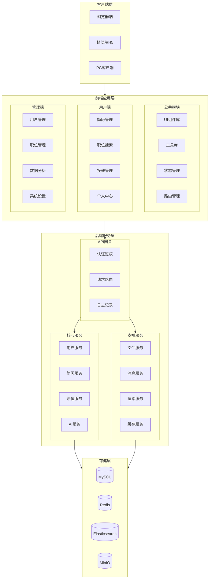

# 系统架构设计文档

## 文档信息
- 版本号: 1.0.0
- 更新日期: 2024-03-04
- 状态: 已审核
- 密级: 内部文档
- 作者: AI招聘系统团队
- 评审人: 系统架构师
- 生效日期: 2024-03-05

## 更新历史
| 版本 | 日期 | 更新内容 | 作者 | 审核人 |
|------|------|----------|------|--------|
| 1.0.0 | 2024-03-04 | 初始版本，完成基础架构设计 | 系统架构组 | 架构师 |
| 1.0.1 | 2024-03-04 | 添加安全性设计和监控方案 | 系统架构组 | 架构师 |
| 1.0.2 | 2024-03-04 | 完善API接口设计和错误处理 | 系统架构组 | 架构师 |

## 目录
- [系统架构设计文档](#系统架构设计文档)
  - [文档信息](#文档信息)
  - [更新历史](#更新历史)
  - [目录](#目录)
  - [系统总体架构](#系统总体架构)

## 系统总体架构

[其余架构说明部分保持不变...]
