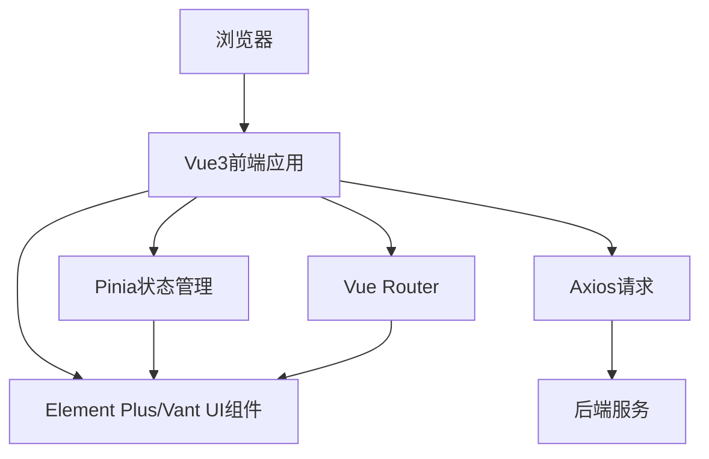
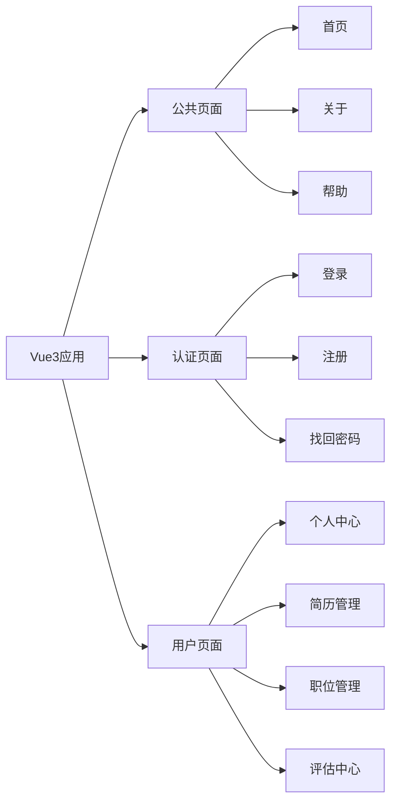
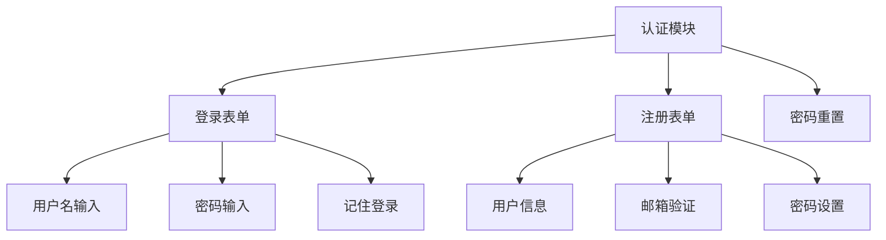
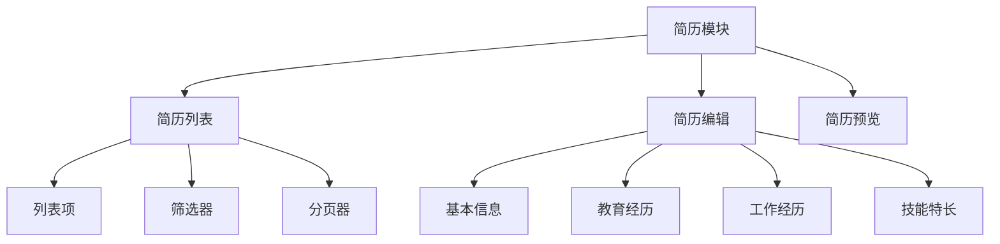
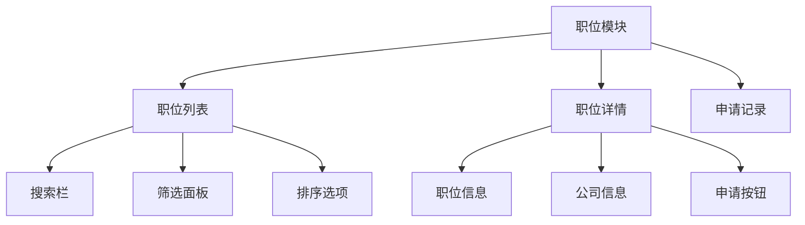
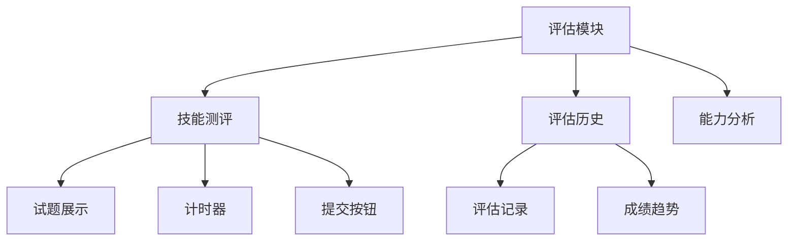
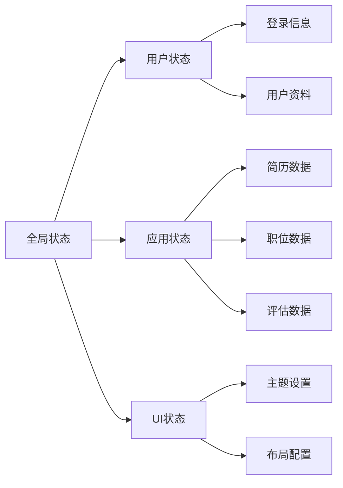
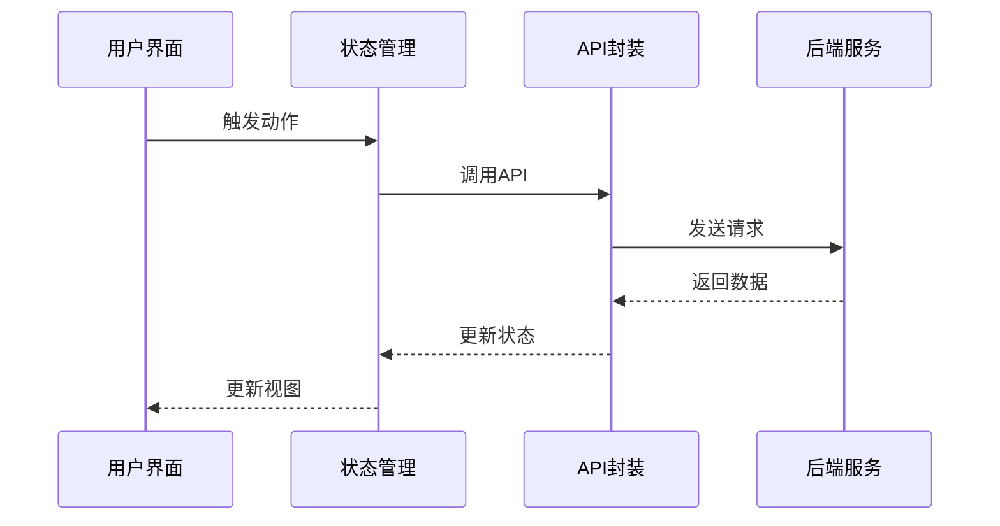
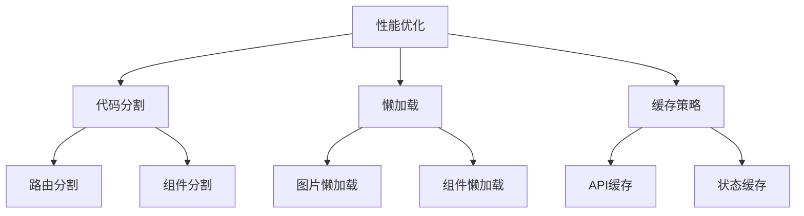
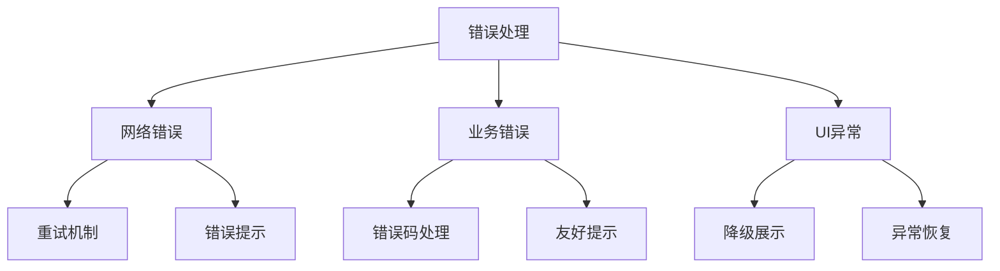

# 前端架构文档

## 系统架构图



## 页面结构



## 组件结构

### 1. 认证相关组件



### 2. 简历相关组件



### 3. 职位相关组件



### 4. 评估相关组件



## 状态管理



## API调用封装

### 1. 认证API
```typescript
interface AuthAPI {
  login(username: string, password: string): Promise<LoginResponse>;
  register(userData: UserRegisterData): Promise<RegisterResponse>;
  resetPassword(email: string): Promise<ResetResponse>;
  refreshToken(): Promise<TokenResponse>;
  logout(): Promise<void>;
}
```

### 2. 简历API
```typescript
interface ResumeAPI {
  uploadResume(file: File, metadata: ResumeMetadata): Promise<UploadResponse>;
  getResumeList(params: ListParams): Promise<ResumeListResponse>;
  getResumeDetail(id: string): Promise<ResumeDetailResponse>;
  parseResume(id: string): Promise<ParseResponse>;
  deleteResume(id: string): Promise<DeleteResponse>;
}
```

### 3. 职位API
```typescript
interface JobAPI {
  getJobList(params: JobListParams): Promise<JobListResponse>;
  getJobDetail(id: string): Promise<JobDetailResponse>;
  applyJob(jobId: string, resumeId: string): Promise<ApplyResponse>;
  favoriteJob(jobId: string): Promise<FavoriteResponse>;
  matchJobs(criteria: MatchCriteria): Promise<MatchResponse>;
}
```

### 4. 评估API
```typescript
interface AssessmentAPI {
  startAssessment(type: string): Promise<AssessmentResponse>;
  submitAnswers(id: string, answers: Answer[]): Promise<SubmitResponse>;
  getHistory(params: HistoryParams): Promise<HistoryResponse>;
  getReport(id: string): Promise<ReportResponse>;
}
```

## 路由配置

```typescript
// Vue Router 配置
import { createRouter, createWebHistory, RouteRecordRaw } from 'vue-router'

const routes: Array<RouteRecordRaw> = [
  {
    path: '/',
    component: () => import('@/layouts/default.vue'),
    children: [
      { path: '', component: () => import('@/views/Home.vue') },
      { path: 'about', component: () => import('@/views/About.vue') },
      { path: 'help', component: () => import('@/views/Help.vue') }
    ]
  },
  {
    path: '/auth',
    component: () => import('@/layouts/auth.vue'),
    children: [
      { path: 'login', component: () => import('@/views/auth/Login.vue') },
      { path: 'register', component: () => import('@/views/auth/Register.vue') },
      { path: 'reset-password', component: () => import('@/views/auth/ResetPassword.vue') }
    ]
  },
  {
    path: '/user',
    component: () => import('@/layouts/user.vue'),
    meta: { requiresAuth: true },
    children: [
      { path: 'profile', component: () => import('@/views/user/Profile.vue') },
      { path: 'resumes', component: () => import('@/views/user/ResumeManagement.vue') },
      { path: 'jobs', component: () => import('@/views/user/JobManagement.vue') },
      { path: 'assessments', component: () => import('@/views/user/AssessmentCenter.vue') }
    ]
  }
];

const router = createRouter({
  history: createWebHistory(),
  routes
});

export default router;
```

## 数据流



## UI组件库使用

### Element Plus/Vant 基础组件
- ElButton/VanButton（按钮）
- ElInput/VanField（输入框）
- ElSelect/VanPicker（选择器）
- ElTable/VanList（表格/列表）
- ElForm/VanForm（表单）
- ElDialog/VanDialog（弹窗）

### 业务组件
- ResumeCard（简历卡片）
- JobItem（职位项）
- AssessmentPanel（评估面板）
- UserAvatar（用户头像）
- SearchFilter（搜索筛选）

## 开发规范

### 1. 命名规范
- 组件名：PascalCase
- 方法名：camelCase
- 常量：UPPER_SNAKE_CASE
- 变量：camelCase

### 2. 文件结构
```
frontend/
├── src/
│   ├── components/    # 通用组件
│   ├── views/         # 页面组件
│   ├── api/          # API封装
│   ├── store/        # 状态管理
│   ├── router/       # 路由配置
│   ├── utils/        # 工具函数
│   └── assets/       # 静态资源
├── tests/            # 测试文件
└── public/           # 公共资源
```

### 3. 代码风格
- 使用TypeScript
- 使用ESLint
- 使用Prettier
- 遵循Vue3风格指南

## 性能优化



## 错误处理

