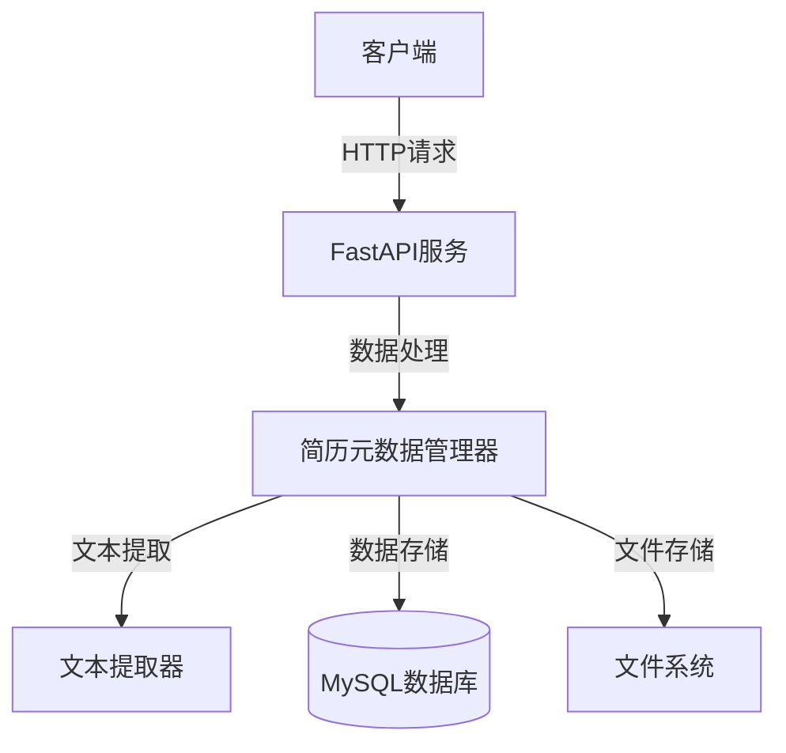
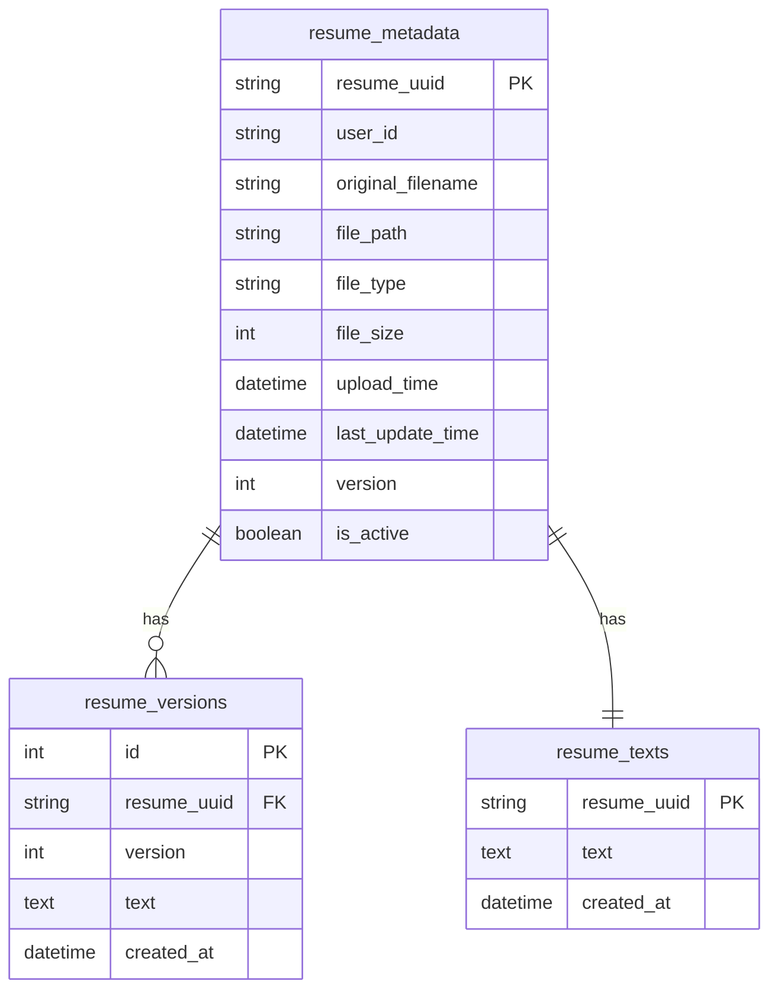
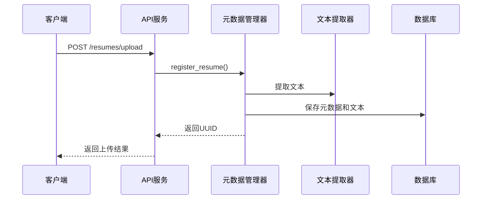
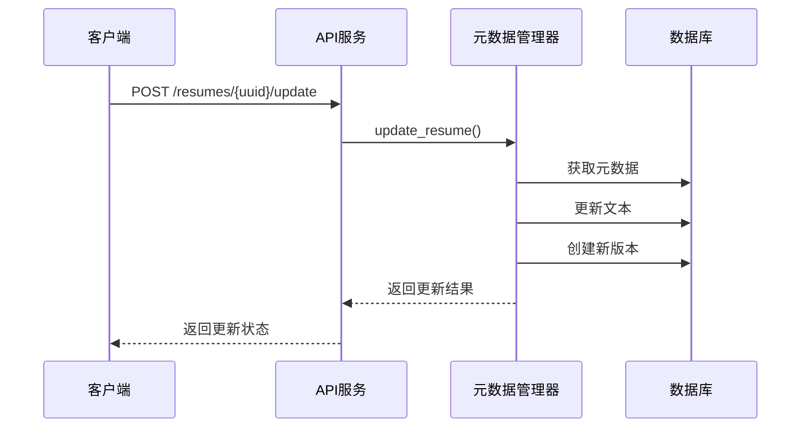
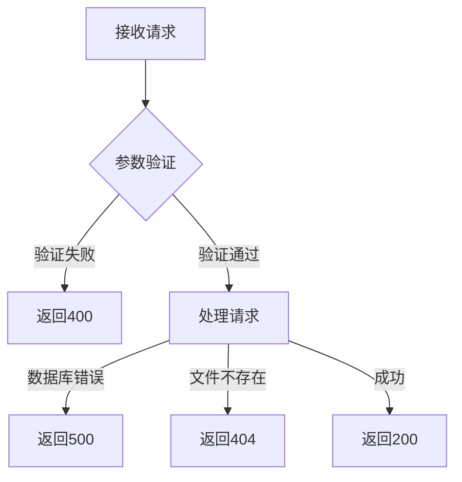
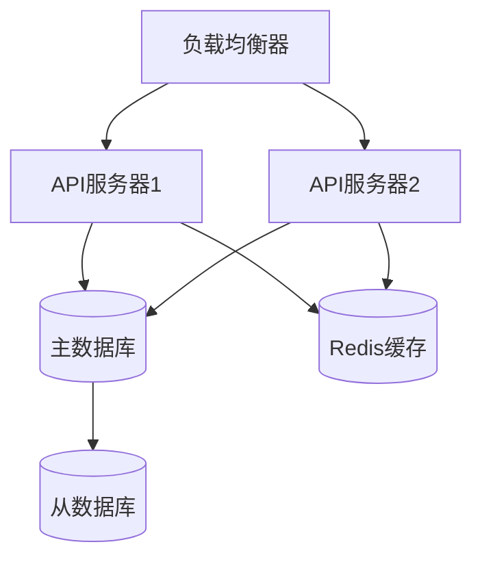

# 简历管理系统设计文档

## 1. 系统概述

本文档详细描述了基于FastAPI和MySQL的简历管理系统的设计与实现。系统提供简历上传、更新、版本控制等功能，支持多种文件格式的文本提取。

## 2. 系统架构



## 3. 数据库设计



## 4. 核心功能流程

### 4.1 简历上传流程



### 4.2 简历更新流程



## 5. API接口设计

### 5.1 接口列表

```mermaid
flowchart LR
    Upload[上传简历] --> |POST| upload[/resumes/upload]
    Update[更新简历] --> |POST| update[/resumes/{uuid}/update]
    GetText[获取文本] --> |GET| text[/resumes/{uuid}/text]
    GetVersions[获取版本] --> |GET| versions[/resumes/{uuid}/versions]
    GetStatus[获取简历状态] --> |GET| status[/resumes/status/{user_id}]
```

### 5.2 接口详情

#### 5.2.1 获取简历状态
- 路径: `/resumes/status/{user_id}`
- 方法: GET
- 参数: 
  - user_id: 用户ID（路径参数）
- 返回: 
  ```json
  {
    "has_resume": true,
    "resume_info": {
      "resume_uuid": "string",
      "original_filename": "string",
      "upload_time": "datetime",
      "last_update_time": "datetime",
      "version": "integer"
    }
  }
  ```
- 说明：
  - has_resume: 是否已上传简历
  - resume_info: 最新简历信息（仅当has_resume为true时返回）
  - 如果用户未上传简历，resume_info为null

#### 5.2.2 上传简历
- 路径: `/resumes/upload`
- 方法: POST
- 参数: 
  - user_id: 用户ID
  - file: 简历文件
- 返回: 
  - resume_uuid: 简历唯一标识
  - metadata: 简历元数据

#### 5.2.3 更新简历
- 路径: `/resumes/{uuid}/update`
- 方法: POST
- 参数:
  - file: 新的简历文件
- 返回:
  - version: 新版本号
  - metadata: 更新后的元数据

## 6. 错误处理机制



## 7. 性能优化

### 7.1 数据库优化
- UUID索引优化
- 文本字段分表存储
- 版本记录增量存储

### 7.2 文件处理优化
- 异步文本提取
- 分块文件上传
- 文本缓存机制

## 8. 安全性设计

### 8.1 文件安全
- 文件类型校验
- 文件大小限制
- 病毒扫描集成

### 8.2 数据安全
- 数据加密存储
- 访问权限控制
- 操作日志记录

## 9. 部署架构



## 10. 监控告警

### 10.1 系统监控
- API响应时间
- 数据库连接状态
- 文件系统容量
- 内存使用率

### 10.2 业务监控
- 上传成功率
- 文本提取成功率
- 版本更新频率
- 用户访问量

## 11. 后续优化计划

1. 引入全文检索功能
2. 支持更多文件格式
3. 添加简历分析功能
4. 优化版本控制机制
5. 增加批量处理能力 