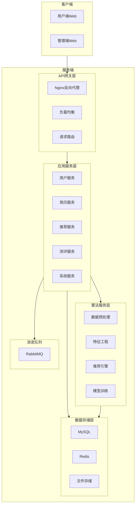
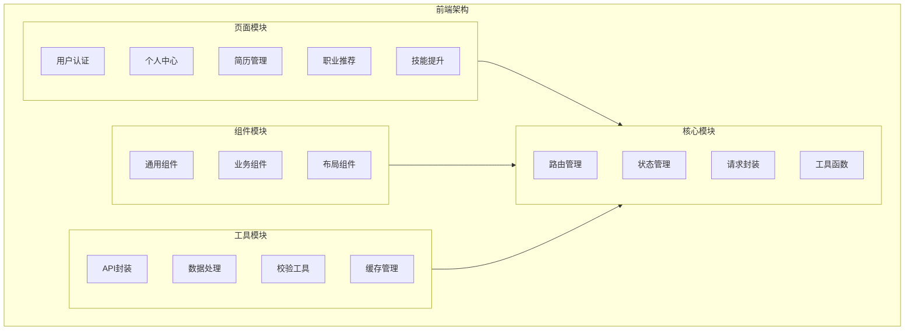
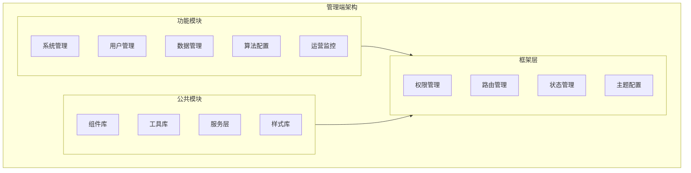
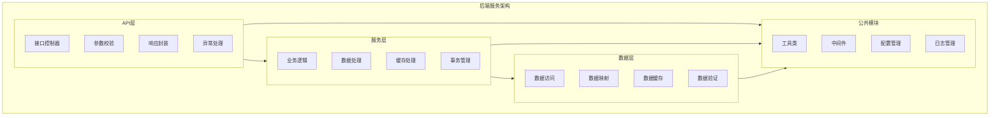
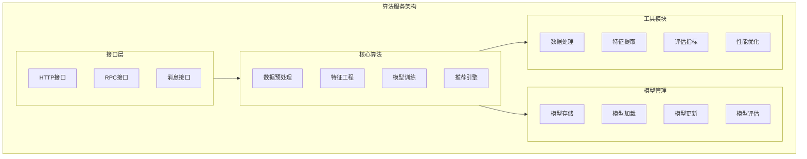
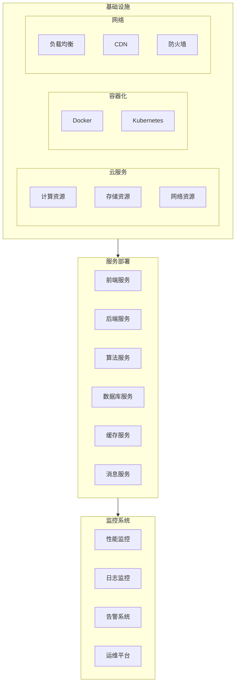

# 高校职业推荐系统架构图

> 最后更新时间：2024-03-21

## 一、整体架构图

```mermaid
graph TB
    subgraph Client["客户端"]
        C1[用户端Web]
        C2[管理端Web]
    end

    subgraph Server["服务端"]
        subgraph Gateway["API网关层"]
            G1[Nginx反向代理]
            G2[负载均衡]
            G3[请求路由]
        end

        subgraph Application["应用服务层"]
            A1[用户服务]
            A2[简历服务]
            A3[推荐服务]
            A4[测评服务]
            A5[系统服务]
        end

        subgraph Algorithm["算法服务层"]
            AL1[数据预处理]
            AL2[特征工程]
            AL3[推荐引擎]
            AL4[模型训练]
        end

        subgraph Storage["数据存储层"]
            S1[MySQL]
            S2[Redis]
            S3[文件存储]
        end

        subgraph Message["消息队列"]
            M1[RabbitMQ]
        end
    end

    Client --> Gateway
    Gateway --> Application
    Application --> Algorithm
    Application --> Storage
    Application --> Message
    Algorithm --> Storage
```

## 二、用户端架构图

```mermaid
graph TB
    subgraph Frontend["前端架构"]
        subgraph Core["核心模块"]
            C1[路由管理]
            C2[状态管理]
            C3[请求封装]
            C4[工具函数]
        end

        subgraph Pages["页面模块"]
            P1[用户认证]
            P2[个人中心]
            P3[简历管理]
            P4[职业推荐]
            P5[技能提升]
        end

        subgraph Components["组件模块"]
            CP1[通用组件]
            CP2[业务组件]
            CP3[布局组件]
        end

        subgraph Utils["工具模块"]
            U1[API封装]
            U2[数据处理]
            U3[校验工具]
            U4[缓存管理]
        end
    end

    Pages --> Core
    Components --> Core
    Utils --> Core
```

## 三、管理端架构图

```mermaid
graph TB
    subgraph Admin["管理端架构"]
        subgraph Framework["框架层"]
            F1[权限管理]
            F2[路由管理]
            F3[状态管理]
            F4[主题配置]
        end

        subgraph Modules["功能模块"]
            M1[系统管理]
            M2[用户管理]
            M3[数据管理]
            M4[算法配置]
            M5[运营监控]
        end

        subgraph Common["公共模块"]
            C1[组件库]
            C2[工具库]
            C3[服务层]
            C4[样式库]
        end
    end

    Modules --> Framework
    Common --> Framework
```

## 四、后端服务架构图

```mermaid
graph TB
    subgraph Backend["后端服务架构"]
        subgraph API["API层"]
            A1[接口控制器]
            A2[参数校验]
            A3[响应封装]
            A4[异常处理]
        end

        subgraph Service["服务层"]
            S1[业务逻辑]
            S2[数据处理]
            S3[缓存处理]
            S4[事务管理]
        end

        subgraph Data["数据层"]
            D1[数据访问]
            D2[数据映射]
            D3[数据缓存]
            D4[数据验证]
        end

        subgraph Common["公共模块"]
            C1[工具类]
            C2[中间件]
            C3[配置管理]
            C4[日志管理]
        end
    end

    API --> Service
    Service --> Data
    API --> Common
    Service --> Common
    Data --> Common
```

## 五、算法服务架构图

```mermaid
graph TB
    subgraph Algorithm["算法服务架构"]
        subgraph Interface["接口层"]
            I1[HTTP接口]
            I2[RPC接口]
            I3[消息接口]
        end

        subgraph Core["核心算法"]
            C1[数据预处理]
            C2[特征工程]
            C3[模型训练]
            C4[推荐引擎]
        end

        subgraph Model["模型管理"]
            M1[模型存储]
            M2[模型加载]
            M3[模型更新]
            M4[模型评估]
        end

        subgraph Utils["工具模块"]
            U1[数据处理]
            U2[特征提取]
            U3[评估指标]
            U4[性能优化]
        end
    end

    Interface --> Core
    Core --> Model
    Core --> Utils
```

## 六、数据流架构图

```mermaid
graph LR
    subgraph Input["数据输入"]
        I1[用户数据]
        I2[简历数据]
        I3[职业数据]
        I4[交互数据]
    end

    subgraph Process["数据处理"]
        P1[数据清洗]
        P2[特征提取]
        P3[数据转换]
        P4[数据存储]
    end

    subgraph Analysis["数据分析"]
        A1[统计分析]
        A2[特征分析]
        A3[模式挖掘]
        A4[趋势分析]
    end

    subgraph Output["数据输出"]
        O1[推荐结果]
        O2[分析报告]
        O3[可视化展示]
        O4[数据接口]
    end

    Input --> Process
    Process --> Analysis
    Analysis --> Output
```

## 七、部署架构图

```mermaid
graph TB
    subgraph Infrastructure["基础设施"]
        subgraph Cloud["云服务"]
            C1[计算资源]
            C2[存储资源]
            C3[网络资源]
        end

        subgraph Container["容器化"]
            CT1[Docker]
            CT2[Kubernetes]
        end

        subgraph Network["网络"]
            N1[负载均衡]
            N2[CDN]
            N3[防火墙]
        end
    end

    subgraph Services["服务部署"]
        S1[前端服务]
        S2[后端服务]
        S3[算法服务]
        S4[数据库服务]
        S5[缓存服务]
        S6[消息服务]
    end

    subgraph Monitor["监控系统"]
        M1[性能监控]
        M2[日志监控]
        M3[告警系统]
        M4[运维平台]
    end

    Infrastructure --> Services
    Services --> Monitor
``` 