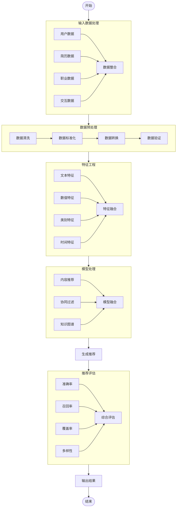
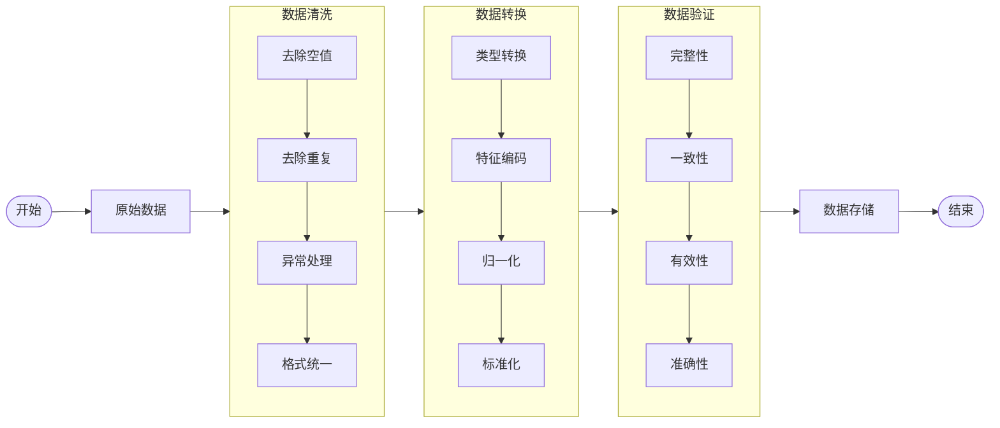
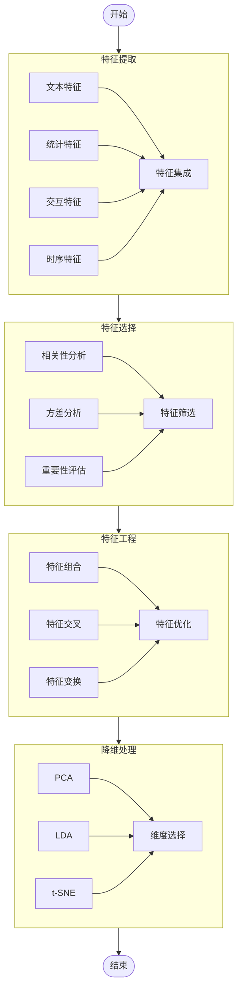
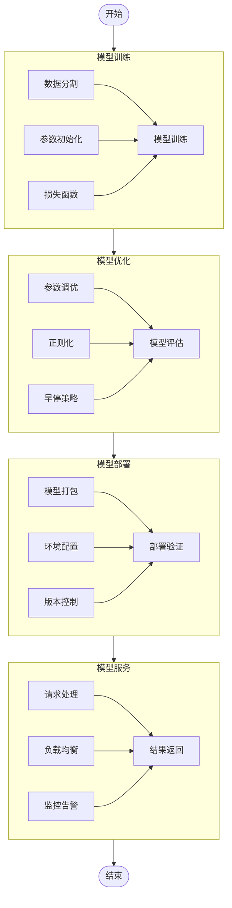
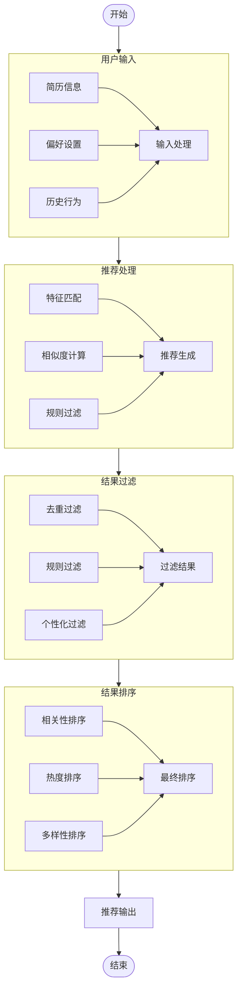
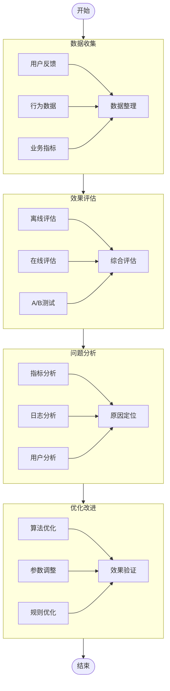

# 高校职业推荐系统算法流程图

> 最后更新时间：2024-03-21

## 一、整体算法流程

```mermaid
flowchart TB
    Start([开始]) --> Input[输入数据]
    Input --> Preprocess[数据预处理]
    Preprocess --> Feature[特征工程]
    Feature --> Model[模型训练/加载]
    Model --> Recommend[生成推荐]
    Recommend --> Evaluate[推荐评估]
    Evaluate --> Output[输出结果]
    Output --> End([结束])

    subgraph Input[输入数据处理]
        I1[用户数据] --> I5[数据整合]
        I2[简历数据] --> I5
        I3[职业数据] --> I5
        I4[交互数据] --> I5
    end

    subgraph Preprocess[数据预处理]
        P1[数据清洗] --> P2[数据标准化]
        P2 --> P3[数据转换]
        P3 --> P4[数据验证]
    end

    subgraph Feature[特征工程]
        F1[文本特征] --> F5[特征融合]
        F2[数值特征] --> F5
        F3[类别特征] --> F5
        F4[时间特征] --> F5
    end

    subgraph Model[模型处理]
        M1[内容推荐] --> M4[模型融合]
        M2[协同过滤] --> M4
        M3[知识图谱] --> M4
    end

    subgraph Evaluate[推荐评估]
        E1[准确率] --> E5[综合评估]
        E2[召回率] --> E5
        E3[覆盖率] --> E5
        E4[多样性] --> E5
    end
```

## 二、数据预处理流程

```mermaid
flowchart LR
    Start([开始]) --> Input[原始数据]
    Input --> Clean[数据清洗]
    Clean --> Transform[数据转换]
    Transform --> Validate[数据验证]
    Validate --> Store[数据存储]
    Store --> End([结束])

    subgraph Clean[数据清洗]
        C1[去除空值] --> C2[去除重复]
        C2 --> C3[异常处理]
        C3 --> C4[格式统一]
    end

    subgraph Transform[数据转换]
        T1[类型转换] --> T2[特征编码]
        T2 --> T3[归一化]
        T3 --> T4[标准化]
    end

    subgraph Validate[数据验证]
        V1[完整性] --> V2[一致性]
        V2 --> V3[有效性]
        V3 --> V4[准确性]
    end
```

## 三、特征工程流程

```mermaid
flowchart TB
    Start([开始]) --> Extract[特征提取]
    Extract --> Select[特征选择]
    Select --> Engineer[特征工程]
    Engineer --> Reduce[降维处理]
    Reduce --> End([结束])

    subgraph Extract[特征提取]
        E1[文本特征] --> E5[特征集成]
        E2[统计特征] --> E5
        E3[交互特征] --> E5
        E4[时序特征] --> E5
    end

    subgraph Select[特征选择]
        S1[相关性分析] --> S4[特征筛选]
        S2[方差分析] --> S4
        S3[重要性评估] --> S4
    end

    subgraph Engineer[特征工程]
        F1[特征组合] --> F4[特征优化]
        F2[特征交叉] --> F4
        F3[特征变换] --> F4
    end

    subgraph Reduce[降维处理]
        R1[PCA] --> R4[维度选择]
        R2[LDA] --> R4
        R3[t-SNE] --> R4
    end
```

## 四、推荐模型流程

```mermaid
flowchart TB
    Start([开始]) --> Train[模型训练]
    Train --> Optimize[模型优化]
    Optimize --> Deploy[模型部署]
    Deploy --> Serve[模型服务]
    Serve --> End([结束])

    subgraph Train[模型训练]
        T1[数据分割] --> T4[模型训练]
        T2[参数初始化] --> T4
        T3[损失函数] --> T4
    end

    subgraph Optimize[模型优化]
        O1[参数调优] --> O4[模型评估]
        O2[正则化] --> O4
        O3[早停策略] --> O4
    end

    subgraph Deploy[模型部署]
        D1[模型打包] --> D4[部署验证]
        D2[环境配置] --> D4
        D3[版本控制] --> D4
    end

    subgraph Serve[模型服务]
        S1[请求处理] --> S4[结果返回]
        S2[负载均衡] --> S4
        S3[监控告警] --> S4
    end
```

## 五、推荐生成流程

```mermaid
flowchart TB
    Start([开始]) --> Input[用户输入]
    Input --> Process[推荐处理]
    Process --> Filter[结果过滤]
    Filter --> Rank[结果排序]
    Rank --> Output[推荐输出]
    Output --> End([结束])

    subgraph Input[用户输入]
        I1[简历信息] --> I4[输入处理]
        I2[偏好设置] --> I4
        I3[历史行为] --> I4
    end

    subgraph Process[推荐处理]
        P1[特征匹配] --> P4[推荐生成]
        P2[相似度计算] --> P4
        P3[规则过滤] --> P4
    end

    subgraph Filter[结果过滤]
        F1[去重过滤] --> F4[过滤结果]
        F2[规则过滤] --> F4
        F3[个性化过滤] --> F4
    end

    subgraph Rank[结果排序]
        R1[相关性排序] --> R4[最终排序]
        R2[热度排序] --> R4
        R3[多样性排序] --> R4
    end
```

## 六、评估优化流程

```mermaid
flowchart TB
    Start([开始]) --> Collect[数据收集]
    Collect --> Evaluate[效果评估]
    Evaluate --> Analyze[问题分析]
    Analyze --> Optimize[优化改进]
    Optimize --> End([结束])

    subgraph Collect[数据收集]
        C1[用户反馈] --> C4[数据整理]
        C2[行为数据] --> C4
        C3[业务指标] --> C4
    end

    subgraph Evaluate[效果评估]
        E1[离线评估] --> E4[综合评估]
        E2[在线评估] --> E4
        E3[A/B测试] --> E4
    end

    subgraph Analyze[问题分析]
        A1[指标分析] --> A4[原因定位]
        A2[日志分析] --> A4
        A3[用户分析] --> A4
    end

    subgraph Optimize[优化改进]
        O1[算法优化] --> O4[效果验证]
        O2[参数调整] --> O4
        O3[规则优化] --> O4
    end
``` 